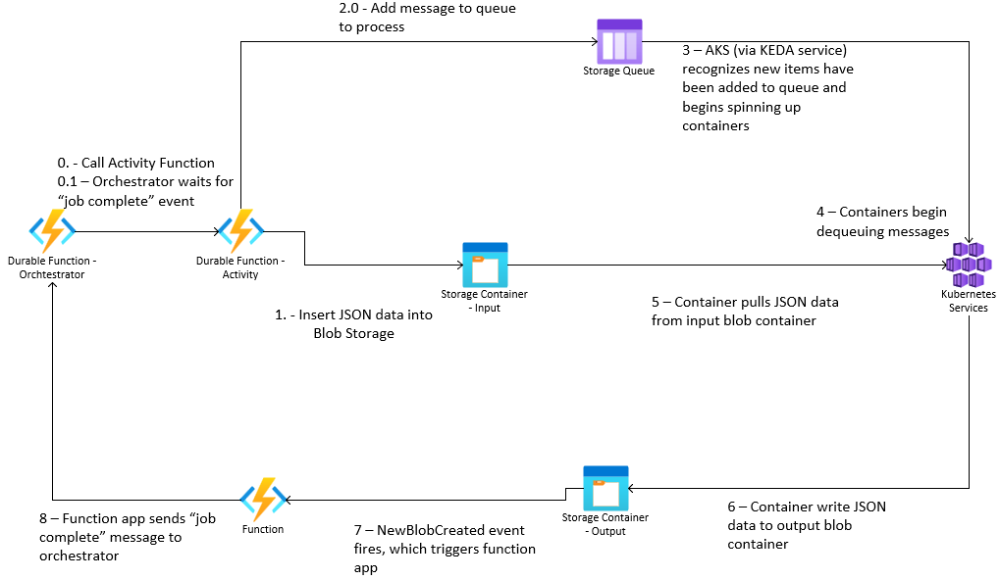

# durable-func-aks-keda

This demo uses [Azure Durable Functions](https://docs.microsoft.com/en-us/azure/azure-functions/durable/durable-functions-overview?tabs=python), [Event Grid](https://docs.microsoft.com/en-us/azure/event-grid/overview), [Azure Kubernetes Service](https://docs.microsoft.com/en-us/azure/aks/) & [KEDA](https://keda.sh/) to provide a general purpose orchestrated compute engine.



## Disclaimer

**THE SOFTWARE IS PROVIDED "AS IS", WITHOUT WARRANTY OF ANY KIND, EXPRESS OR IMPLIED, INCLUDING BUT NOT LIMITED TO THE WARRANTIES OF MERCHANTABILITY, FITNESS FOR A PARTICULAR PURPOSE AND NONINFRINGEMENT. IN NO EVENT SHALL THE AUTHORS OR COPYRIGHT HOLDERS BE LIABLE FOR ANY CLAIM, DAMAGES OR OTHER LIABILITY, WHETHER IN AN ACTION OF CONTRACT, TORT OR OTHERWISE, ARISING FROM, OUT OF OR IN CONNECTION WITH THE SOFTWARE OR THE USE OR OTHER DEALINGS IN THE SOFTWARE.**

## Prerequisites

Install the following prerequisites.

- [Azure CLI](https://docs.microsoft.com/en-us/cli/azure/)
- [Azure Functions Core Tools](https://docs.microsoft.com/en-us/azure/azure-functions/functions-run-local?tabs=v3%2Clinux%2Ccsharp%2Cportal%2Cbash%2Ckeda)
- [Helm](https://helm.sh/docs/intro/install/)

## Deployment

1.  Create a new resource group in your Azure subscription

1.  Navigate to `infra/init` directory

1.  Run the Azure CLI command to deploy the initial infrastructure (substitute your resource group name)

    ```shell
    az deployment group create --resource-group rg-func-aks-keda-ussc-demo --template-file ./main.bicep --parameters ./demo.parameters.json
    ```

1.  Navigate to the `src/compute` directory

1.  Submit the container compute code to the [Azure Container Registry](https://docs.microsoft.com/en-us/azure/container-registry/) to build & store the Docker image (substitute your container registry name)

    ```shell
    az acr build --image compute --registry acrfuncAksKedausscdemo --file Dockerfile .
    ```

1.  Navigate to the `src/orchestrator` directory

1.  Deploy the Azure Durable Function code to Azure (substitute the name of your function app)

    ```shell
    func azure functionapp publish func-funcAksKeda-ussc-demo
    ```

1.  Navigate to the `infra/container` directory

1.  Deploy the container infrastructure to Azure (you will have to substitute some of these values for the Azure resource names that were created in the earlier step, all of these values can be found in the output of the previous Azure infrastructure deployment)

    ```shell
    az deployment group create --resource-group rg-func-aks-keda-ussc-demo --template-file ./main.bicep --parameters ./demo.parameters.json --parameters storageAccountName=safuncakskedausscdemo --parameters containerRegistryName=acrfuncAksKedausscdemo --parameters logAnalyticsWorkspaceName=la-funcAksKeda-ussc-demo --parameters newBlobCreatedEventGridTopicName=egt-NewInputBlobCreated-funcAksKeda-ussc-demo --parameters orchtestrationFunctionAppName=func-funcAksKeda-ussc-demo --parameters storageAccountOutputContainerName=output
    ```

1.  Install KEDA into your AKS cluster via Helm

    ```shell
    helm repo add kedacore https://kedacore.github.io/charts

    helm repo update

    kubectl create namespace keda

    helm install keda kedacore/keda --namespace keda
    ```

1.  Create the `compute` namespace in your AKS cluster to own all the resources related to this deployment

    ```shell
    kubectl create namespace compute
    ```

1.  Get the connection string to your storage container (it is in the output of the first Azure deployment or look in the Azure portal) and create a Kubernetes secret

    ```shell
    kubectl create secret generic azure-connection-strings --from-literal=storage-account-connection-string='DefaultEndpointsProtocol=https;AccountName=safuncakskedausscdemo;AccountKey=mRjYE+CoUk2mSnlCFakekeyeTTb6cJ229tLMM/qUYpPHHXnF4OrPuM/DqCWrUfjNK6va8+reWLDzGRyJA==;EndpointSuffix=core.windows.net' -n compute
    ```

1.  Navigate to the `infra/aks/compute` directory & install the Helm chart for this deployment (substitute the container registry name & the storage account name)

    ```shell
    helm install --namespace compute --values ./values.yaml --set image.registry=acrfuncAksKedausscdemo.azurecr.io --set image.repository=compute --set storage.storageAccountName=safuncakskedausscdemo --set storage.inputQueueName=input --set storage.inputStorageContainerName=input compute .
    ```

## Execute

The Azure Durable Function has been set up to respond to an HTTP trigger. Run a `curl` command to kick it off (note the `inputCount`, customize as needed)

```shell
curl --request POST --url https://func-funcAksKeda-ussc-demo.azurewebsites.net/api/orchestrators/ComputeOrchestrator?inputCount=1000 --header "Content-Length: 0"
```

You will get an output with a unique identifier for the orchestration run & some URIs to get the status.

```json
{
    "id": "33842dacb38d4b20b1a04ebc7463325c",
    "statusQueryGetUri": "https://func-funcakskeda-ussc-demo.azurewebsites.net/runtime/webhooks/durabletask/instances/33842dacb38d4b20b1a04ebc7463325c?taskHub=funcfuncAksKedausscdemo&connection=Storage&code=OGWAo5TPdjX6PTg6zP1G5Xaxmzr8zwJTPlf2voKRTETmt4ESRb75hw==",
    "sendEventPostUri": "https://func-funcakskeda-ussc-demo.azurewebsites.net/runtime/webhooks/durabletask/instances/33842dacb38d4b20b1a04ebc7463325c/raiseEvent/{eventName}?taskHub=funcfuncAksKedausscdemo&connection=Storage&code=OGWAo5TPdjX6PTg6zP1G5Xaxmzr8zwJTPlf2voKRTETmt4ESRb75hw==",
    "terminatePostUri": "https://func-funcakskeda-ussc-demo.azurewebsites.net/runtime/webhooks/durabletask/instances/33842dacb38d4b20b1a04ebc7463325c/terminate?reason={text}&taskHub=funcfuncAksKedausscdemo&connection=Storage&code=OGWAo5TPdjX6PTg6zP1G5Xaxmzr8zwJTPlf2voKRTETmt4ESRb75hw==",
    "rewindPostUri": "https://func-funcakskeda-ussc-demo.azurewebsites.net/runtime/webhooks/durabletask/instances/33842dacb38d4b20b1a04ebc7463325c/rewind?reason={text}&taskHub=funcfuncAksKedausscdemo&connection=Storage&code=OGWAo5TPdjX6PTg6zP1G5Xaxmzr8zwJTPlf2voKRTETmt4ESRb75hw==",
    "purgeHistoryDeleteUri": "https://func-funcakskeda-ussc-demo.azurewebsites.net/runtime/webhooks/durabletask/instances/33842dacb38d4b20b1a04ebc7463325c?taskHub=funcfuncAksKedausscdemo&connection=Storage&code=OGWAo5TPdjX6PTg6zP1G5Xaxmzr8zwJTPlf2voKRTETmt4ESRb75hw==",
    "restartPostUri": "https://func-funcakskeda-ussc-demo.azurewebsites.net/runtime/webhooks/durabletask/instances/33842dacb38d4b20b1a04ebc7463325c/restart?taskHub=funcfuncAksKedausscdemo&connection=Storage&code=OGWAo5TPdjX6PTg6zP1G5Xaxmzr8zwJTPlf2voKRTETmt4ESRb75hw=="
}
```

You can query the status by either curling the `statusQueryGetUri`.

**statusQueryGetUri**

```shell
curl "https://func-funcakskeda-ussc-demo.azurewebsites.net/runtime/webhooks/durabletask/instances/33842dacb38d4b20b1a04ebc7463325c?taskHub=funcfuncAksKedausscdemo&connection=Storage&code=OGWAo5TPdjX6PTg6zP1G5Xaxmzr8zwJTPlf2voKRTETmt4ESRb75hw=="
```

```json
{
  "name":"ComputeOrchestrator",
  "instanceId":"33842dacb38d4b20b1a04ebc7463325c",
  "runtimeStatus":"Running",
  "input":null,
  "customStatus":null,
  "output":null,
  "createdTime":"2021-10-01T13:36:25Z",
  "lastUpdatedTime":"2021-10-01T13:36:26Z"
}
```

Here are the results using the [Azure Storage Explorer](https://docs.microsoft.com/en-us/azure/vs-azure-tools-storage-explorer-blobs)


## Orchestration

The orchestration function manages the overall work process. Each step reports its status back to the orchestration function. It keeps track of the status of all work.

Here is the overall flow:

1.  A HTTP request is received to the Durable Function endpoint
1.  The orchestration function kicks off (defined in `src/orchestrator/ComputeOrchestrator/__init__.py`)
1.  The orchestration function generates some input data and begins the orchestration
1.  For each input data block, a `Compute` function is called (defined in `src/orchestration/Compute/__init__.py`)
1.  Each `Compute` function writes an input blob to the Azure Blob Storage input container & a message to the Azure Storage Queue with the path to the file
    - Note that the `Compute` function doesn't call any actual computation function, all it does it put an input file in storage & a path to the file in the queue. This makes it so that the `Compute` function doesn't have to know anything about how the computation actually occurs. They are loosely coupled.
1.  The KEDA process running in the AKS cluster will begin to spin up containers to process the queue messages
1.  The Azure Kubernetes Service containers will pull each message off the queue, process the input data & write output data back to blob storage
1.  When an output blob is created in the Azure Blob Storage output container, another `Microsoft.Storage.BlobCreated` message will get created. Another Azure Function will get called to process this message.
1.  The Azure Function (defined in `src/orchestrator/ComputeComplete/__init__.py`) will raise an event so the orchestration function is notified that a computation is complete.
1.  After all the computations are complete (meaning all of the raise events have fired), the orchestration function will report that its status is `Complete`

## Container compute

Each container is self contained and does not communicate with the other containers. It only reads the next message from the Azure Storage Queue and processes it. The Azure Storage Queue ensures a message is only processed by 1 container. If that container fails to complete the processing of the message, it will be put back on the queue and processed by another container. Once the container has received a message, it downloads the message from the Azure Blob Storage. It then computes the result and writes the result to a different Azure Blob Storage container. It then reports success to the Storage Queue and deletes the original input data. 


Look in the `src/compute/main.py` & `src/compute/algorithm/__init__.py` to see where to add your own algorithm.

## KEDA

[KEDA](https://keda.sh/) is a service that gives you event-driven autoscaling in Kubernetes. This service listens to an queue you give it (such as an Azure Storage Queue) and scales pods up and down based upon the configuration options you provide. You can specify the minimum number of pods (including zero), the maximum number of pods & the length of queue messages you want to target.

This is specified in the `infra/aks/compute/templates/compute.yaml` Helm chart.

```yaml
apiVersion: keda.sh/v1alpha1
kind: ScaledObject
metadata:
  name: compute-scaled-object
spec:
  scaleTargetRef:
    apiVersion: apps/v1
    kind: Deployment
    name: compute-deployment
  pollingInterval: {{ .Values.scale.pollingInterval }}
  cooldownPeriod: {{ .Values.scale.cooldownPeriod }}
  minReplicaCount: {{ .Values.scale.minReplicaCount }}
  maxReplicaCount: {{ .Values.scale.maxReplicaCount }}
  triggers:
  - type: azure-queue
    metadata:
      queueName: {{ .Values.storage.inputQueueName }}
      queueLength: '{{ .Values.scale.targetLengthOfQueue }}'
      accountName: {{ .Values.storage.storageAccountName }}
      cloud: AzurePublicCloud
    authenticationRef:
      name: azure-queue-auth
```

Using this in conjunction with the node pool autoscaler (specified in the `infra/container/aks.bicep` file), this solution will scale up as more messages are put on the queue and scale down as messages are processed.

## Web App

Included in this repo is a web app you can use to monitor the # of work items, the # of AKS pods & the # of node pools serving your code.

1.  First, start up a [Kubernetes proxy](https://kubernetes.io/docs/tasks/extend-kubernetes/http-proxy-access-api/). This allows the web app to communicate with the Kubernetes cluster without having a separate authentication system in place.

    ```shell
    kubectl proxy --port=8080
    ```

1.  Get the connection string to connect to the storage queue

    ```shell
    az storage account show-connection-string -g rg-func-aks-keda-ussc-demo -n safuncakskedausscdemo
    ```

1.  Update the connection string in the `src/web-app-chart/appsettings.json` file

    ```
    "ConnectionStrings": {
      "StorageAccountConnectionString": "DefaultEndpointsProtocol=https;AccountName=safuncakskedausscdemo;AccountKey=mRjYE+CoUk2mSnlCdaeFFakekeyJ229tLMM/qUYpPHHXnF4OrPuM/DqCWrUfjNK6va8+reWLDzGRyJA==;EndpointSuffix=core.windows.net"
    },
    ```

1.  Start up the web app

    ```shell
    cd src/web-app-chart
    dotnet run -c Release
    ```

3.  Navigate to the URL

    ```
    https://localhost:5001
    ```

4.  Submit a web request to start the Azure Durable Function

    ```shell
    curl -X POST https://func-funcAksKeda-ussc-demo.azurewebsites.net/api/orchestrators/ComputeOrchestrator?inputCount=100 -H 'Content-Length: 0'
    ```

You can see the web app begin to populate with data (it refreshes every 5 seconds).


## References

- https://docs.microsoft.com/en-us/azure/azure-functions/durable/durable-functions-overview?tabs=python
- https://docs.microsoft.com/en-us/azure/storage/common/storage-introduction?toc=/azure/storage/blobs/toc.json
- https://docs.microsoft.com/en-us/azure/storage/queues/storage-queues-introduction
- https://docs.microsoft.com/en-us/azure/event-grid/overview
- https://docs.microsoft.com/en-us/azure/aks/
- https://keda.sh/
- https://docs.microsoft.com/en-us/azure/logic-apps/
- https://docs.microsoft.com/en-us/cli/azure/
- https://docs.microsoft.com/en-us/azure/container-registry/
- https://docs.microsoft.com/en-us/azure/vs-azure-tools-storage-explorer-blobs
